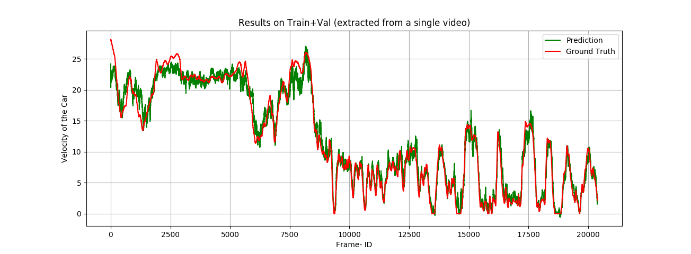
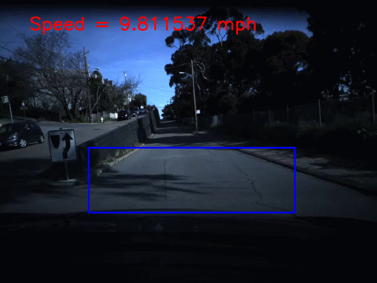

## Building Model to estimate Velocity of Car from Front Cam Video

A pair of subsequent frames is selected to obtain optical flow. This flow image is used to learn the velocity of the ego-car.

### Requirements-
python 3.5.2
Tensorflow-Gpu==1.7
Keras==2.2.4

### File Info as follows-
1. tdg.py -> Has Training Data Generator Object for Neural Networks Train/Eval
2. data_creator.py -> Has functions to preprocess videos and visualize results on video
3. utils.py -> Side utility functions useful in multiple parts of the repository
4. io_args.py -> Argument Parser for different inputs
5. train_eval.py -> Performs training
6. eval_pipeline.py -> Store model's inferred output on train/test data into pickle files
7. rough_plots.py -> Visualize model results and store results as text files 
8. model_set.py -> Keras Model Definitions

### Results on Train+Val

### A mini demo-

